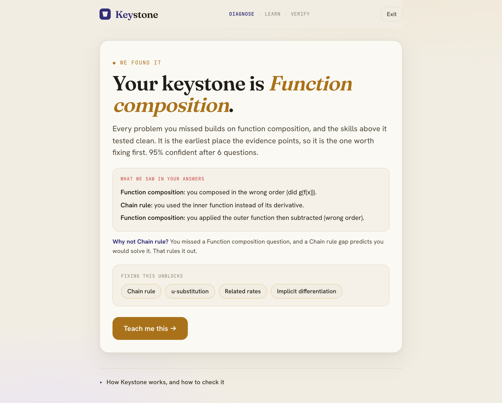

# Keystone

**Keystone finds the hidden prerequisite skill causing a student's mistakes, reteaches that exact gap, and verifies the fix actually improved mastery.**



Most tutoring tools reteach the skill where the error showed up. But the visible mistake is usually not the real problem. A student who keeps missing the chain rule may not have a chain-rule problem at all: the real gap might be function composition, one layer underneath. Keystone is a diagnostic engine that finds the cause beneath the visible error and closes the loop.

Built for the Prometheus July AI Challenge. Single subject: single-variable calculus.

---

## The workflow a judge sees

```
Student answers a question
        v
BKT updates per-skill mastery
        v
A Bayesian model updates a probability over every possible root-cause skill
        v
The engine picks the next question that best separates the leading hypotheses
        v   (repeat until confident, or "insufficient evidence")
Diagnosis: keystone skill + the evidence ("what we saw", "why not the runner-up")
        v
Claude writes a targeted micro-lesson + three fresh practice questions
        v
Practice loop: each answer re-measures mastery -> session report (before% / now%)
```

The last steps are the differentiator. Many entries diagnose, or generate a fix. Keystone diagnoses, fixes, **and** verifies, then hands the student a session report they can copy to their teacher.

In the app: **Start the diagnostic** and miss a couple of composition-flavored questions; the model rules out the chain rule, lands on **function composition**, shows the misconceptions it observed in your actual answers, teaches that one skill, and re-measures it across a practice run. (Or click **Watch a 30-second sample** for the hands-off version.)

---

## Four intelligence layers

Each layer answers a question the others cannot. This is why "AI is core, not an afterthought" is literally true here: remove any layer and the product stops working.

| Layer | Question it answers | Method | Where it lives |
|---|---|---|---|
| 1. Mastery tracking | What does the student know? | Bayesian Knowledge Tracing, per skill | [`engine/bkt.js`](frontend/src/engine/bkt.js) |
| 2. Root-cause diagnosis | Why are they struggling? | Bayesian posterior over "which skill is the gap" | [`engine/diagnosis.js`](frontend/src/engine/diagnosis.js) |
| 3. Question selection | What should we ask next? | Expected information gain (entropy reduction) | [`engine/selection.js`](frontend/src/engine/selection.js) |
| 4. Intervention | How do we reteach it? | Claude, fed structured diagnostic evidence | [`services/claude.js`](frontend/src/services/claude.js) |

**The one line to remember: the model finds the gap, the LLM only explains it.** Claude never decides the keystone. It receives structured evidence (the diagnosed skill, mastery probability, the student's observed error tags, mastered prerequisites, blocked skills) and returns a strict-JSON micro-lesson plus three fresh practice questions. Without an API key, a deterministic lesson + per-keystone practice bank serves the same shapes, so the app never depends on the network.

---

## The root-cause algorithm (Layer 2)

This is the core idea, and none of it is hardcoded to a particular skill.

- One hypothesis per skill: `h_s` = "skill `s` is the single true gap." Under `h_s`, the student is **impaired** on `s` and every downstream skill in the prerequisite graph, and **capable** on everything else.
- Likelihood of an observation (a skill, correct or incorrect): impaired means P(correct) = guess (~0.2); capable means P(correct) = 1 - slip (~0.9).
- Posterior over hypotheses is prior x product of likelihoods, computed in log space and softmaxed. A `healthy` hypothesis ("no gap") gets a mild prior head start, so a gap has to be *earned* by evidence.

**"Why not the chain rule" falls out of the math.** The chain-rule hypothesis predicts the student passes composition, because composition is not downstream of the chain rule. If they failed composition, that single observation penalizes the chain-rule hypothesis automatically. Keystone finds the observation with the largest log-likelihood ratio between the winner and the runner-up and templates a sentence from it. Real reasoning, not a hardcoded string.

**Insufficient-evidence gate.** Keystone only declares a keystone when all of: observations >= 4, top hypothesis probability >= 0.5, and the top is a real skill (not `healthy`). Otherwise it says "more evidence needed" and recommends the next question. Profile D exists to prove the system refuses to force a confident answer.

The two prerequisite edges that make discrimination clean:
- `exponent_rules -> power_rule`: an exponent gap breaks every derivative rule, but not composition.
- `function_composition -> chain_rule`: a composition gap breaks the chain rule, but not the power rule.

The chain rule has two parents on purpose (power rule and composition), which is what lets the engine separate a composition gap from a chain-rule gap from an exponent gap using downstream evidence.

---

## Model validation

Honesty is a scoring factor, and judges check. So the labels are exact.

**In the app** (the "How Keystone works" footer): a **synthetic cohort** of ~1,200 simulated students generated from the misconception/BKT model. Held-out next-answer prediction, BKT vs baselines, seeded so the numbers are stable:

| Model | ROC AUC | Accuracy | Brier |
|---|---|---|---|
| **BKT (this model)** | **0.775** | **0.712** | **0.182** |
| Baseline: previous answer | 0.699 | 0.689 | 0.259 |
| Baseline: majority / base rate | 0.500 | 0.628 | 0.243 |

This measures calibration on synthetic students, not real-world accuracy. It is labeled "synthetic cohort, not real students" in the UI.

**In [`evaluation/`](evaluation/)** (pure-Python, standard library only): an offline EM fit of BKT parameters plus a held-out evaluation, again on a synthetic cohort. The EM fitter recovers the generating parameters to a mean absolute error of ~0.01, and on held-out prediction:

| Model | ROC AUC | Accuracy | Brier |
|---|---|---|---|
| **BKT** | **0.740** | **0.842** | **0.123** |
| majority | 0.500 | 0.811 | 0.190 |
| previous_answer | 0.670 | 0.784 | 0.216 |

`evaluation/` also ships an **optional** real-data path (`--data`) for the public, de-identified ASSISTments math dataset. That path has **not** been run here, and no ASSISTments numbers are claimed. See [`evaluation/model_card.md`](evaluation/model_card.md).

We do not claim the model was trained on real calculus students, because it was not.

---

## Demo profiles

Four scripted students prove the engine is not hardcoded. Each is a real sequence of answers to real questions.

| Profile | True gap | Keystone diagnosed |
|---|---|---|
| A (Ava) | function composition | function_composition (95%) |
| B (Ben) | chain-rule procedure | chain_rule (61%) |
| C (Cam) | exponent / algebra | exponent_rules (94%) |
| D (Dana) | only 2 mixed answers | insufficient evidence |

The headless test in [`tests/test_profiles.js`](tests/test_profiles.js) runs all four through the full pipeline and asserts each diagnosis, plus the graph invariants. The app renders the same PASS/FAIL live.

---

## Run it locally

Frontend (no backend required, everything runs client-side):

```bash
cd frontend
npm install
npm run dev        # open the printed localhost URL
```

Headless engine tests:

```bash
node tests/test_profiles.js      # or: cd frontend && npm test
```

Offline evaluation (Python 3, standard library only):

```bash
cd evaluation
python3 fit_bkt.py               # fits BKT via EM on a synthetic cohort
python3 evaluate.py              # held-out AUC / accuracy / Brier vs baselines
```

**Live Claude is optional.** By default the intervention uses deterministic fallback lessons so the demo never breaks. To use the live API, paste an Anthropic API key into the field at the bottom of the app (kept only in memory, never stored). The key is used from the browser with the direct-browser-access header; the model is `claude-opus-4-8`.

---

## Limitations

- The prerequisite graph (20 skills, ~26 edges) is hand-designed by us, not learned from data.
- All in-repo validation is on synthetic students. There is no real-student learning-outcome evidence.
- One subject (single-variable calculus) and a ~24-question bank. It is a focused demo, not a full curriculum.
- The verification loop reports an updated mastery estimate, not proof of learning. The UI says so.

---

## Rubric mapping

Short version below; full mapping in [`docs/rubric-mapping.md`](docs/rubric-mapping.md).

- **Educational Impact.** Drilling symptoms wastes time; Keystone quantifies the win ("one root cause blocking N downstream skills"), gives a teacher summary card, targets remediation, and verifies it.
- **Creative Use of AI/ML.** Four connected layers: a sequential mastery model, a graph-based root-cause posterior, information-gain question selection, and an evidence-constrained generative intervention. AI is inseparable from the product.
- **Technical Execution.** A calibrated model with real validation numbers, live probabilistic updates, automated profile tests, a graceful uncertainty state, an API fallback, and a clean UI.
- **Pitch & Demo.** One problem, one student, one surprising diagnosis, one targeted fix, one verified result.

---

## Repository layout

```
keystone/
  frontend/          React + Vite app (runs everything client-side)
    src/engine/      bkt, diagnosis, selection, graph, validation
    src/data/        skills, edges, questions, practice, demoProfiles, parameters.json
    src/components/  QuestionCard, HowItWorks
    src/services/    claude.js (live API + deterministic fallback)
  evaluation/        offline BKT fit + held-out evaluation (pure Python)
  tests/             headless profile + invariant tests (node)
  docs/              architecture, rubric mapping
```

---

Keystone asks: what missing idea made that error inevitable?

## License

MIT. See [LICENSE](LICENSE).
