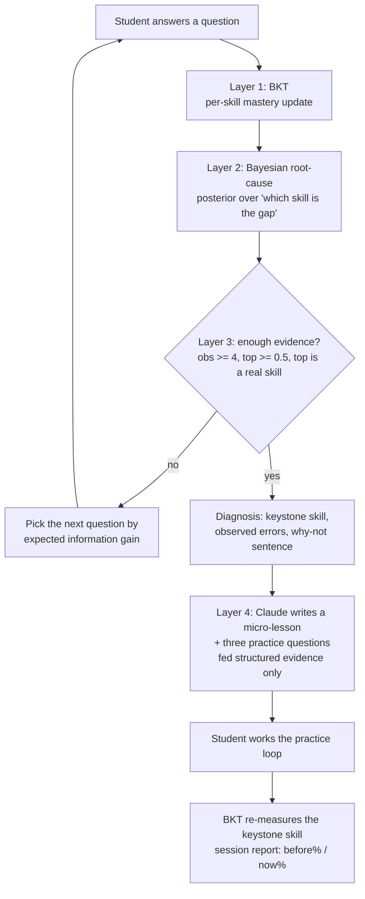

# Architecture

Keystone is a single closed loop. Layers 1 to 3 are a client-side probabilistic engine; layer 4 is a
generative intervention constrained by the engine's output. There is no live backend on the demo path.

## Data flow between layers

- **Layer 1 (BKT)** maintains a mastery probability per skill. It colors the graph nodes and, in the
  verification step, produces the before/after delta on the keystone skill. Parameters come from
  `frontend/src/data/parameters.json` (informed priors; the offline fit in `evaluation/` refits them
  on a synthetic cohort).

- **Layer 2 (diagnosis)** treats each skill as a hypothesis "this skill is the single gap." Under a
  hypothesis, the student is impaired on that skill and everything downstream of it in the prerequisite
  graph. It scores every hypothesis by prior times the product of per-observation likelihoods (log space,
  softmax), including a `healthy` hypothesis with a mild prior head start. Output: the ranked posterior,
  the gate decision, the impaired subgraph, and the "why not the runner-up" explanation (the observation
  with the largest log-likelihood ratio between winner and runner-up).

- **Layer 3 (selection)** measures current uncertainty as the entropy of the posterior. For each
  candidate question it simulates both outcomes, weighted by the posterior's own predicted P(correct),
  and computes the expected posterior entropy. Information gain is current minus expected; it picks the
  max and reports which two leading hypotheses that question separates.

- **Layer 4 (intervention)** is the only place an LLM runs, and it never chooses the keystone. It gets a
  structured evidence object and must return strict JSON: misconception, analogy, worked example, and a
  verification question with choices and the correct index. Deterministic fallback lessons cover the
  common keystones so the demo survives an API failure.

## The prerequisite graph

20 skills across foundations, functions, limits, derivatives, applications, and integration, connected
by ~26 directed prerequisite edges (`frontend/src/data/edges.js`). Two edges carry the diagnostic story
and must not be removed:

- `exponent_rules -> power_rule`: an exponent gap breaks every derivative rule, but not composition.
- `function_composition -> chain_rule`: a composition gap breaks the chain rule, but not the power rule.

The chain rule deliberately has two parents (power rule and function composition). That two-parent
structure is what lets the engine tell a composition gap apart from a chain-rule gap apart from an
exponent gap, using only downstream evidence.

## Why client-side

Fitting BKT offline once and exporting `parameters.json` means the whole engine runs in the browser with
zero deployment risk on demo day. A FastAPI/pyBKT backend is possible but explicitly out of scope for the
demo; the offline scripts in `evaluation/` are the "real validation" path.
